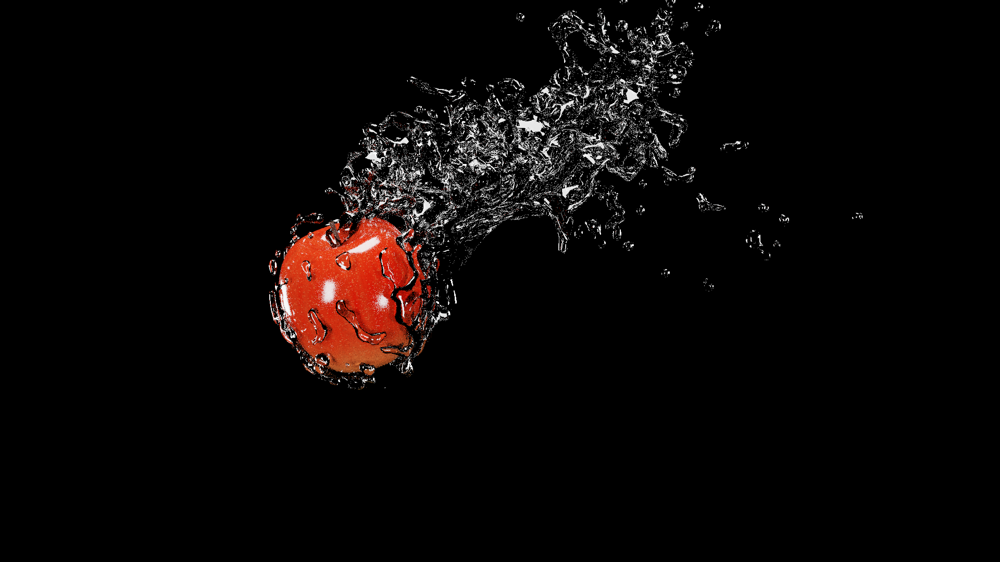

# Kanahebi Renderer

レイトレ合宿11提出用のOptiX 9.0対応のHydraレンダラープラグインとCLIレンダラーのプロジェクトです。



レイトレ合宿11: https://sites.google.com/view/rtcamp11

## Clone repository with submodules

submodule込みでリポジトリをクローンします。

```bash
git clone --recurse-submodules https://github.com/MatchaChoco010/kanahebi-renderer.git
cd kanahebi-renderer
```

## Build

サポートOSはLinuxとWindowsです。
サポートアプリケーションはHoudini 21.0とBlender 4.5、そしてCLIレンダラーです。


---

### Build Hydra Render Plugin for Houdini 21.0 Linux

Houdini 21.0向けのHydraレンダラープラグインをビルドします。

#### Build OpenUSD

OpenUSDをHoudini 21.0向けの設定でビルドします。

```bash
./scripts/build-usd.linux.houdini-21.0.sh
```

#### Build this project

CMakeでこのプロジェクトをビルドします。

```bash
export OPTIX_PATH=/path/to/optix
cmake --preset houdini-21.0-linux
cmake --build --preset houdini-21.0-linux
```

#### Enable Houdini Hydra Renderer Plugin

Houdiniの環境変数を設定して、Hydraレンダラープラグインを有効化します。
PXR_PLUGINPATH_NAMEでプラグインが読み込まれます。
HOUDINI_PATHの定義によってHoudiniのRender Settings LOPに専用GUIが追加されます。

```bash
export PXR_PLUGINPATH_NAME=/path/to/repo/dist/houdini-21.0-linux/hdKanahebi/resources
export HOUDINI_PATH="/path/to/repo/dist/houdini-21.0-linux/hdKanahebi/resources;&"
houdini"
```

---

### Build Hydra Render Plugin for Blender 4.5 Linux

Blender 4.5向けのHydraレンダラープラグインをビルドします。

#### Build OpenUSD

OpenUSDをBlender 4.5向けの設定でビルドします。

```bash
./scripts/build-usd.linux.blender-4.5.sh
```

#### Build this project

CMakeでこのプロジェクトをビルドします

```bash
export OPTIX_PATH=/path/to/optix
cmake --preset blender-4.5-linux
cmake --build --preset blender-4.5-linux
```

#### Enable Blender Hydra Renderer Plugin

`./dist/blender-4.5-linux/hdKanahebi.zip`のBlender ExtensionをBlenderのGUIでディスクからインストールします。

---

### Build CLI Renderer for Linux

CLIのレンダラーアプリケーションをビルドします。

#### Build OpenUSD

OpenUSDをCLI向けの設定でビルドします。

```bash
./scripts/build-usd.linux.cli.sh
```

#### Build this project

CMakeでこのプロジェクトをビルドします。

```bash
export OPTIX_PATH=/path/to/optix
cmake --preset cli-linux
cmake --build --preset cli-linux
```

#### Run CLI Renderer

CLIレンダラーを実行します。
詳しいオプションについては`--help`を参照してください。

```bash
./dist/cli-linux/kanahebi-cli.sh /path/to/scene.usd
```

---

### Build Hydra Render Plugin for Houdini 21.0 Windows

Houdini 21.0向けのHydraレンダラープラグインをビルドします。

#### Build OpenUSD

OpenUSDをHoudini 21.0向けの設定でビルドします。

```bash
./scripts/build-usd.windows.houdini-21.0.ps1
```

#### Build this project

CMakeでこのプロジェクトをビルドします。

```bash
$Env:OPTIX_PATH="/path/to/optix"
cmake --preset houdini-21.0-windows
cmake --build --preset houdini-21.0-windows --config Release
```

#### Enable Houdini Hydra Renderer Plugin

Houdiniの環境変数を設定して、Hydraレンダラープラグインを有効化します。
PXR_PLUGINPATH_NAMEでプラグインが読み込まれます。
HOUDINI_PATHの定義によってHoudiniのRender Settings LOPに専用GUIが追加されます。

```bash
$Env:PXR_PLUGINPATH_NAME="/path/to/repo/dist/houdini-21.0-windows/hdKanahebi/resources"
$Env:HOUDINI_PATH="/path/to/repo/dist/houdini-21.0-windows/hdKanahebi/resources;&"
houdini"
```

---

### Build Hydra Render Plugin for Blender 4.5 Windows

Blender 4.5向けのHydraレンダラープラグインをビルドします。

#### Build OpenUSD

OpenUSDをBlender 4.5向けの設定でビルドします。

```bash
./scripts/build-usd.windows.blender-4.5.ps1
```

#### Build this project

CMakeでこのプロジェクトをビルドします

```bash
$Env:OPTIX_PATH="/path/to/optix"
cmake --preset blender-4.5-windows
cmake --build --preset blender-4.5-windows --config Release
```

#### Enable Blender Hydra Renderer Plugin

`./dist/blender-4.5-windows/hdKanahebi.zip`のBlender ExtensionをBlenderのGUIでディスクからインストールします。

---

### Build CLI Renderer for Windows

CLIのレンダラーアプリケーションをビルドします。

#### Build OpenUSD

OpenUSDをCLI向けの設定でビルドします。

```bash
./scripts/build-usd.windows.cli.ps1
```

#### Build this project

CMakeでこのプロジェクトをビルドします。

```bash
$Env:OPTIX_PATH="/path/to/optix"
cmake --preset cli-windows
cmake --build --preset cli-windows --config Release
```

#### Run CLI Renderer

CLIレンダラーを実行します。
詳しいオプションについては`--help`を参照してください。

```bash
./dist/cli-windows/kanahebi-cli /path/to/scene.usd
```
